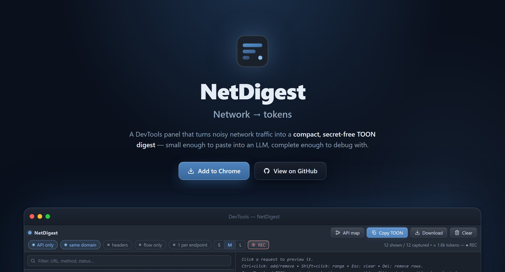

<p align="center">
  
</p>

<p align="center">
  <a href="LICENSE"></a>
  
  
  
  <a href="CONTRIBUTING.md"></a>
</p>

<p align="center">
  <b>Your app's network traffic, ready to paste into an LLM — without burning your context window.</b>
</p>

---

You're debugging with Claude, ChatGPT or Cursor. The model asks: *"what does the API actually return?"*

Your options today are all bad: a **HAR export** is megabytes of headers, cookies and base64 noise. Hand-copying responses **loses the flow** (which click fired which call?). And both happily leak your **tokens and passwords**.

**NetDigest is one extra DevTools tab.** It captures the traffic you already see, strips everything an LLM doesn't need, and hands you a digest that reads like a story: *what the user did → what the app called → what came back.*

## How much smaller?

```text
HAR export (full)         ████████████████████   100%   ~72,400 tokens
Raw JSON bodies           ███████████████░░░░░    75%   ~54,500 tokens
NetDigest (TOON, M)       ███░░░░░░░░░░░░░░░░░    15%   ~11,000 tokens
  + “1 per endpoint”      ██░░░░░░░░░░░░░░░░░░    12%   ~8,400 tokens
```

Measured on a realistic 32-request session (large lists, a 456-key settings dump, duplicate polling, query variants) — reproduce it yourself with `pnpm bench`. Spot check from a real app: a **3.4 MB** `/users` response becomes **~60 lines** that still show every key.

And the structure survives: every object keeps **all** of its keys. What gets cut — long strings, repeated array items, deep nesting — is replaced by markers (`…[+147 items, 150 total]`) the model knows how to read, because every export starts with a preamble that explains them.

## What it looks like

```text
- type: marker
  label: "click button \"Sign in\""
- startedDateTime: "2026-06-12T01:21:28.430Z"
  method: POST
  url: "https://api.example.dev/api/login"
  status: 200
  initiator: "src/auth/LoginForm.tsx:41:20 (LoginForm.useMutation[signIn])"
  requestBody:
    email: jo@example.dev
    password: ***
  responseBody:
    success: true
    data:
      user: { id: 7, name: Jo Dev }
      token: ***
```

The click, the hook that fired the request, the payload with secrets already redacted, the response — in token-efficient [TOON](https://github.com/toon-format/toon).

## Features

- 🪶 **Marker-aware compaction** — strings, arrays and depth are truncated; **every key survives**. Re-truncation always reports the *original* totals.
- 🔁 **Dedup ×N + diff** — identical calls merge into one entry; array items after the first only show the fields that differ from item 0.
- 🕵️ **Always-on redaction** — passwords, tokens, API keys, JWT-looking values → `***`. Auth headers and cookies are never captured at all.
- 🎬 **Flow recorder** — one click arms it: clicks, form submits and SPA navigations become timeline steps between the requests they triggered.
- 🧭 **Real initiators** — source maps resolve every call back to `src/hooks/useArticles.ts:18 (useArticles.useQuery)`, not a hashed chunk.
- 🗺️ **API map** — one click condenses the session into a normalized endpoint contract: methods, statuses, query keys, example shapes.
- 🎚️ **Token budget control** — S/M/L detail levels, per-endpoint overrides, live token counter in the status bar.
- 🧹 **Curation** — API-only / same-domain / flow-only / 1-per-endpoint filters, search, multi-select, `Del` to drop rows.

## Quick start

```bash
pnpm install
pnpm wxt prepare   # pnpm 10 blocks postinstall scripts — run once
pnpm dev           # opens Chrome with the extension loaded
```

Or `pnpm build` and load `.output/chrome-mv3` as an unpacked extension.

1. Open your app, hit `F12` → **NetDigest** tab (capture runs from the moment DevTools opens)
2. Click **Record**, use your app, watch the story build itself
3. Cherry-pick endpoints (`Ctrl+click`), pick a detail level, **Copy TOON**
4. Paste into your LLM. That's it.

🖥️ **Try it without installing:** `pnpm landing && npx serve landing/dist` — the landing page embeds the *real, unmodified* panel running on scripted demo traffic.

## How the compaction thinks

| Level | Strings | Array items | Depth | Use for |
|---|---|---|---|---|
| **S** | 64 chars | 1 | 3 | API surface overviews |
| **M** *(default)* | 255 chars | 3 | 6 | day-to-day debugging |
| **L** | 1024 chars | 8 | 10 | deep dives |

One endpoint deserves more? Select it and override `items / depth / chars` just for it — persisted forever.

## Privacy

No backend, no analytics, no telemetry. Everything happens inside your DevTools session and leaves your machine only when **you** press copy. See [SECURITY.md](SECURITY.md).

## Contributing

PRs welcome — the codebase is small and documented in [CONTRIBUTING.md](CONTRIBUTING.md) (dev setup, architecture map, the two invariants to respect). Changelog in [CHANGELOG.md](CHANGELOG.md).

## License

[MIT](LICENSE) © Youcef Djidjelli
